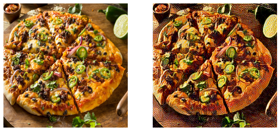

# WhiteBox-Cartoonization

## Link to Demo App

https://whitebox-cartoonization-xhjdgjxxck4sk9bylpajol.streamlit.app/

<!--https://whitebox-cartoonization-xhjdgjxxck4sk9bylpajol.streamlit.app/-->
<!--[](https://mybinder.org/v2/gh/MOAZ47/WhiteBox-Cartoonization/HEAD?urlpath=voila%2Frender%2Fapp.ipynb)-->
<!--https://whitebox-cartoon.herokuapp.com/-->


---

<!---->


## Introduction

Animation is used widely in many fields like films and gaming. This repository provides an implementation of the paper [**“Learning to Cartoonize Using White-Box Representation”** by Xinrui Wang et al](https://ieeexplore.ieee.org/document/9157493). The authors propose a method to cartoonize real-world images by identifying three different representations of an image: surface representation, structure representation, and texture representation. These representations are then used along with a Generative Adversarial Network (GAN) to produce animated images with harmonious colors and diverse artistic styles.

## Methodology

### Surface Extraction

Surface extraction involves smoothing the surface of the image by extracting low-frequency components while preserving color composition and surface texture. We use a deep guided filter for this purpose.

### Structure Extraction

Structure representation captures global structural information and sparse color blocks. We use the Felzenswalb algorithm, a graph-based segmentation method, to group similar pixels together.

### Texture Extraction

Texture representation converts the input image to a single-channel intensity map, preserving relative pixel intensity while removing color and luminance. This mimics the cartoon painting process where artists draw a line sketch before adding color.

### Generative Adversarial Network (GAN)

We use a GAN framework for image-to-image translation. The GAN consists of a generator and two discriminators. The generator produces realistic-looking images from random noise, while the discriminators distinguish between real and generated images. Our GAN framework includes a surface discriminator and a texture discriminator to optimize the cartoonization process.

### Image-to-Image Translation

Our GAN model performs image-to-image translation, transforming real-world photos into cartoon images by leveraging the extracted representations.

## Modeling Approach

Our proposed model uses a GAN framework with a generator (G) and two discriminators (Ds and Dt). The discriminators aim to distinguish between surface and texture representations extracted from model outputs and cartoons. A pre-trained VGG network is used to extract high-level features and impose spatial constraints on global contents. The total loss is the sum of surface, texture, structure, content, and total variational losses, allowing users to control the output style.

### Training Steps

1. Train the discriminator.
2. Generate fake samples from the generator.
3. Decompose the output image into surface, texture, and structure representations.
4. Compute and backpropagate losses through the discriminator.
5. Train the generator by optimizing its parameters based on computed losses.
6. Repeat until all epochs are completed.

## Experimental Setup

### GAN Architecture

The generator is a fully-convolutional U-Net-like network with an encoder-decoder structure. The discriminator uses a simple architecture with convolution, Leaky ReLU, and spectral norm layers.

### Hyperparameters

- Epochs: 200
- Pre-train epochs: 10
- Learning Rate: 2e-4
- Batch Size: 16
- Image Size: 256
- Lambda Surface: 0.1
- Lambda Texture: 1
- Lambda Structure: 200
- Lambda Content: 200
- Lambda Variation: 10000

### Dataset

We created a diverse dataset containing real-world photos from the FFHQ dataset and various landscapes. Cartoon images were collected from the works of "Makoto Shinkai". The training set consists of 2500 real-world photos and 2500 cartoon photos, with a validation set of 2500 photos.

### Evaluation Metric

We use Frechet Inception Distance (FID) to evaluate the fidelity and diversity of generated images. Manual inspection is also performed to ensure image quality.

## Results

At the start of training, the FID value was around 510, which decreased to around 490 by the end. The best result was obtained at the 55th epoch, producing images that met the expected quality standards.

## Examples



## Installation

1. Clone the repository:
    ```bash
    git clone https://github.com/MOAZ47/WhiteBox-Cartoonization.git
    cd WhiteBox-Cartoonization
    ```

2. Install the required packages:
    ```bash
    pip install -r requirements.txt
    ```

3. Run the application:
    ```bash
    python compute.py
    ```
4. To run the streamlit application:
   ```bash
   streamlit run streamlit_app.py
   ```
   

## References

1. [Xinrui Wang et al, "Learning to Cartoonize Using White-Box Representation".](https://ieeexplore.ieee.org/document/9157493)
2. [References to filter-based and optimization techniques.](https://ieeexplore.ieee.org/document/710815)
3. [Deep guided filter reference.](https://openaccess.thecvf.com/content_cvpr_2018/html/Wu_Fast_End-to-End_Trainable_CVPR_2018_paper.html)
4. [Felzenswalb algorithm reference.](https://link.springer.com/article/10.1023/B:VISI.0000022288.19776.77)
5. [GANs reference.](https://papers.nips.cc/paper/2014/hash/5ca3e9b122f61f8f06494c97b1afccf3-Abstract.html)
6. [Image-to-image translation reference.](https://www.researchgate.net/publication/320966887_Image-to-Image_Translation_with_Conditional_Adversarial_Networks)
7. [Frechet distance reference.](https://wandb.ai/ayush-thakur/gan-evaluation/reports/How-to-Evaluate-GANs-using-Frechet-Inception-Distance-FID---Vmlldzo0MTAxOTI)
